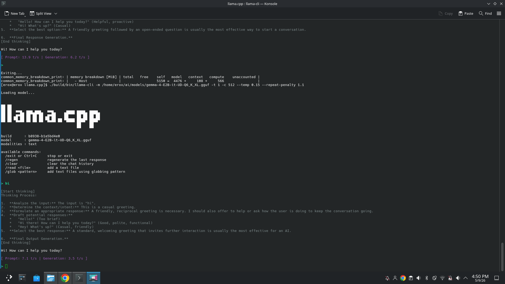

#  Turning an Ordinary HP Laptop into a Local AI Workstation

> *What started as a simple "let's see if this even boots" experiment somehow ended with a 20B model generating hundreds of lines of usable code on a CPU-only ultrabook.* 🔥🗿

This repository documents my journey of running modern GGUF language models locally using `llama.cpp` on an **HP 15s-du3060TX**.

No RTX 4090. No cloud APIs. No secret datacenter.

Just:

* Intel Core i5-1135G7
* 16 GB RAM
* Arch Linux
* zram
* A screaming fan
* And a concerning amount of `"btw I use Arch"` energy

---

## 🚀 Why This Repo Exists

A lot of people assume local LLMs are only practical if you have:

* A monster GPU
* 64+ GB RAM
* A budget that makes your wallet cry

I wanted to answer a simpler question:

> **How far can a normal laptop be pushed with smart software optimization?**

The answer surprised me.

I was able to run:

* GPT-OSS 20B Q4_K_S
* Gemma 4B Q5_K_M
* Gemma 4 E2B Q6_K_XL
* Context windows up to **163k tokens**
* Hundreds of lines of coherent code generation

All on a consumer laptop.

And yes, the model still insisted it was "ChatGPT running in the cloud" while living entirely inside my RAM. 💀

---

## 💻 Hardware

| Component | Specification                                                       |
| --------- | ------------------------------------------------------------------- |
| Laptop    | HP 15s-du3060TX                                                     |
| CPU       | Intel Core i5-1135G7 (4 cores / 8 threads, AVX2)                    |
| GPU       | NVIDIA MX350 2 GB *(installed, driverless, watching from the void)* |
| RAM       | 16 GB DDR4-3200 (2×8 GB)                                            |
| Storage   | WD SN570 NVMe SSD                                                   |
| Cooling   | Laptop rear elevated for better airflow                             |
| OS        | Arch Linux *(KDE for daily life, pure TTY for benchmark mode)*      |

For context: this is a normal student laptop, not a workstation.

The dedicated MX350 was present but unused, silently watching the CPU and Intel graphics do all the work.

> *"It should have been me."* 😭

---

## 🐧 Software Stack

This setup is minimal by design.

* Arch Linux
* Pure TTY (`Ctrl + Alt + F2`)
* `llama.cpp`
* GGUF quantized models
* zram with LZ4 compression
* `script` and `tee` for session logging
* `btop` for monitoring the CPU slowly question its life choices

---

## 🏅 Man of the Match

> **AVX2 was the man of the match.** 🏆

`llama.cpp` relies heavily on AVX2-optimized SIMD kernels for:

* Matrix multiplication
* Quantized tensor math
* Attention
* Sampling

Without AVX2, these results would have been dramatically slower.

```text
The real GPU was the AVX2 instructions we used along the way.
```

### Honorable Mentions

* zram with LZ4 compression
* Pure TTY mode
* Careful thread tuning

---

## 🧠 Why Single-Thread Performance Matters

One of the most surprising findings was that Gemma 4 E2B Q6_K_XL achieved:

> **3.5 tok/s on a single CPU thread.**

This is a direct result of:

1. Intel's long-standing focus on strong single-thread performance.
2. `llama.cpp`'s highly optimized AVX2 inference kernels.

Since around 2016, Intel has prioritized:

* Higher IPC
* Larger caches
* Better branch prediction
* Aggressive turbo frequencies
* AVX2 vector acceleration

LLM inference is not perfectly parallel, so per-core performance matters enormously.

> GPU owners: "How many TFLOPS do you have?"
> Me: "One thread is enough."

---

## ⚡ The Biggest Optimization: TTY Mode

The single most dramatic improvement came from ditching KDE Plasma and running directly in a TTY.

### Gemma 4B Q5_K_M Performance

| Environment |     Speed |
| ----------- | --------: |
| KDE Plasma  | 4–5 tok/s |
| Pure TTY    | 12+ tok/s |

That is not a small difference.

That is a full-on transformation.

TTY mode turned the system from:

```text
This is neat, but kinda sluggish.
```

into:

```text
Wait... this is actually usable.
```

### Why TTY Helps

TTY removes:

* Desktop compositor
* Background UI services
* Browser overhead
* Animations
* A surprising amount of RAM pressure

Result: more memory, more cache, and more thermal headroom for the model.

---

## 🧠 Memory Strategy: zram + LZ4

If AVX2 was the MVP, zram was the unexpected clutch player.

Compressed RAM gave the system enough breathing room to run models that had no business fitting this comfortably.

### Configuration

* **30.7 GB zram**
* **LZ4 compression**

### Actual Usage During GPT-OSS 20B

* Only ~4 GB zram used

### What This Means

* The model mostly fit in physical RAM
* zram acted as a safety buffer
* SSD swapping was largely avoided

> **The system was stressed, but not panicking.**

---

## 🧵 Thread Tuning

Using all 8 threads was not optimal.

Best performance came from:

```text
6 threads for llama.cpp
2 threads reserved for the kernel and zram compression/decompression
```

That balance helped maintain smooth throughput under heavy memory pressure.

> Sometimes fewer threads really do go brrr faster.

---

## 🚀 Benchmark Results

### GPT-OSS 20B Q4_K_S

| Metric                 |         Result |
| ---------------------- | -------------: |
| Short prompt speed     |     11.9 tok/s |
| Long code generation   |  8.0–8.5 tok/s |
| Prompt processing      |    28–34 tok/s |
| Largest tested context | 163,184 tokens |

### Gemma 4B Q5_K_M

| Metric     |    Result |
| ---------- | --------: |
| KDE Plasma | 4–5 tok/s |
| Pure TTY   | 12+ tok/s |

### Gemma 4 E2B Q6_K_XL

| Threads | Prompt Speed | Generation Speed | Context |
| ------: | -----------: | ---------------: | ------: |
|       1 |    7.1 tok/s |        3.5 tok/s |     512 |
|       2 |   13.9 tok/s |        6.2 tok/s |  16,384 |
|       7 |   26.1 tok/s |       10.4 tok/s |  16,384 |

**Host memory usage:** ~5.15 GB

These results were obtained in KDE Plasma, not even pure TTY mode.

The most surprising result was the single-thread benchmark: one CPU thread was enough to run a practical local LLM.

---

## 🧪 The Accidental 163k Token Stress Test

This benchmark was not originally planned.

I was increasing context sizes by multiplying `512 × n` to observe performance changes.

Somewhere in the middle of this very scientific process, I accidentally calculated:

```text
8192 × 2 = 163,184
```

instead of the far more reasonable:

```text
16,384
```

Yes.

I somehow turned a simple arithmetic typo into a large-scale stress test.

Since the model was already launching, I decided to let it run and see what happened.

And somehow… it worked.

---

## 🔥 The 163k Token Stress Test

### Expected Outcome

```bash
systemctl start chaos.service
```

### Actual Outcome

* The model still worked.
* The system remained responsive.
* Fans entered jet-engine mode.
* The CPU began bargaining with thermodynamics.

This was not practical.

It was purely an experiment to find where reality bends.

---

## 🧾 Code Generation Experiments

### 🌐 HTML/CSS/JS Calculator

Generated hundreds of lines before descending into recursive HTML entity madness:

```html
&#x3D;&#x3D;&#x3D;
```

### 🤖 Arduino PID Controller

Generated 250+ coherent lines with:

* Clean structure
* Correct logic
* No major hallucinations

### 🛠️ Extended Firmware Template

Generated roughly 800 lines before switching to placeholder helper functions.

Even when it drifted, it stayed surprisingly useful.

---

## 🤔 Model Personality Notes

### GPT-OSS 20B

#### Strengths

* Excellent code generation
* Strong math and technical reasoning
* Very capable for engineering tasks

#### Weaknesses

* Not ideal for casual conversation
* Verbose reasoning traces
* Occasionally insists it is ChatGPT in the cloud 😭

### Gemma Models

#### Strengths

* Better conversational feel
* Excellent instruction following
* Fast and lightweight

#### Weaknesses

* Verbose by default
* Uses extra tokens on disclaimers

---

## 🛠️ Commands Used

### Run GPT-OSS 20B

```bash
./build/bin/llama-cli \
  -m ~/ai/models/gpt-oss-20b-Q4_K_S.gguf \
  -t 6 \
  -c 8192 \
  -n 2048 \
  --temp 0.2 \
  --repeat-penalty 1.1
```

### Save Full TTY Session

```bash
mkdir -p ~/llm_chats
script ~/llm_chats/chat_$(date +%F_%H-%M-%S).log
```

### Clean the Session Log

```bash
col -b < chat.log > chat_clean.txt
```

### Monitoring

```bash
btop
watch -n 1 free -h
watch sensors
```

---

## 🌡️ Thermal Engineering (aka "Lift the Laptop")

A simple but effective trick:

* Raise the rear of the laptop
* Keep vents unobstructed
* Use a hard surface

This improved sustained performance enough to matter.

> Sometimes the best cooling pad is just gravity.

---

## 💾 Planned Upgrade: 24 GB RAM

### Current Configuration

* 16 GB (2×8 GB)

### Planned Upgrade

* 24 GB (8 GB + 16 GB)

### Expected Benefits

* Less zram usage
* More room for larger models
* Larger contexts
* Greater stability

---

## 🧠 Biggest Lessons Learned

1. TTY mode can be a game changer.
2. zram is incredibly effective.
3. Thread balancing matters.
4. AVX2 and strong single-thread performance are absurdly powerful.
5. Smaller, better-tuned models can feel superior.
6. Software optimization often matters more than raw hardware.
7. Thanks for nothing, NVIDIA. 😭
8. One well-optimized CPU core can be enough to run a practical local LLM.

---

## 😵‍💫 The Debugging Nightmares

This benchmark involved a few classic Linux plot twists:

* Display driver crash caused by one lonely hyphen blinking in the top-left corner.
* NVIDIA setup headaches.
* `fstab` backstabbing me.
* Filesystem and package-manager surprises.
* An arithmetic typo that accidentally launched a 163k-token stress test.

```text
One missing character.
Three hours gone.
```

And after all that, the model still ran.

---

## 🏆 Final Verdict

This benchmark proved that a regular student laptop can become a genuinely useful local AI workstation.

Not by throwing expensive hardware at the problem.

But by understanding:

* Memory
* Threading
* Thermals
* Operating system overhead
* Model behavior

That, to me, is the coolest part.

---

## 🚀 Future Plans

* Upgrade to 24 GB RAM
* Benchmark Gemma 27B / 28B
* Compare more quantizations
* Add screenshots and charts
* Publish updated benchmark tables

---

## 📸 Screenshots

Screenshots and phone photos of benchmark runs, TTY outputs, and code generation examples will be added here.
also my pc display panel delivers good contrast so the phones photo on tty looks cool



---

## 🗿 Closing Thought

The funniest part of this entire experiment was watching a model running locally on my laptop confidently claim:

> "I am ChatGPT, a cloud-based AI assistant."

Meanwhile reality was:

* Arch Linux
* TTY mode
* 16 GB RAM
* zram
* AVX2
* Fans screaming
* One very determined i5-1135G7

And somehow… it worked. 😭🔥🗿
